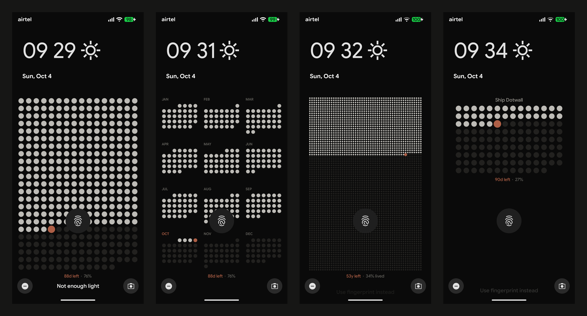

# Dots

A tiny Android app that draws a minimalist dot-grid wallpaper and sets it as your **lock screen**, then redraws it every day. Built for a Pixel 7a, sideloaded, personal use. No internet permission, no analytics.



Real captures from a Pixel 7a: Year grid, Year months, Life and a Goal.

## Features

- **Year**: one dot per day, as a grid or as 12 month blocks. Today is in the accent color.
- **Life**: one dot per week of life, 52 per row.
- **Goal**: one dot per day from a start date to a deadline. Save several goals, one active. After the deadline it shows `Done` or `Missed` for 3 days, then falls back to Year.
- Live preview with ghost shapes for the clock, fingerprint and shortcuts, so you can see clearances.
- Accent presets and custom hex, charcoal or pure black background, circle or rounded-square dots, two densities, adjustable placement band.
- Redraws shortly after midnight, after reboot, and when the time, date or time zone changes.
- Kotlin, Jetpack Compose and plain `Canvas`. Release APK is about 2.7 MB.

`PLAN.md` is the spec. `render.py` is the visual reference the Kotlin renderer was ported from.

## Build

Needs JDK 17 and the Android SDK (`local.properties` with `sdk.dir`).

```sh
./gradlew assembleDebug testDebugUnitTest lintDebug   # debug build, unit tests, lint
./gradlew assembleRelease                              # app/build/outputs/apk/release/app-release-unsigned.apk
```

Release APK is about 2.7 MB (R8 and resource shrinking on, English only).

## Sign for personal use

```sh
# one time
keytool -genkeypair -v -keystore ~/dots.jks -alias dots -keyalg RSA -keysize 2048 -validity 10000

# every release
BT=$ANDROID_HOME/build-tools/$(ls $ANDROID_HOME/build-tools | sort -V | tail -1)
$BT/zipalign -f -p 4 app/build/outputs/apk/release/app-release-unsigned.apk /tmp/dots-aligned.apk
$BT/apksigner sign --ks ~/dots.jks --out dots.apk /tmp/dots-aligned.apk
adb install -r dots.apk
```

For a quick test, `./gradlew installDebug` or `adb install -r app/build/outputs/apk/debug/app-debug.apk` also works.

## Set up

1. Open the app. The preview shows the wallpaper with grey ghost shapes for the clock, At a Glance lines, fingerprint and shortcuts.
2. Pick a mode and tweak the look and placement. Every change shows in the preview at once.
3. Tap **Apply**. The lock screen changes (home screen untouched unless "Lock + Home" is chosen).
4. After the first Apply the wallpaper redraws by itself at about 00:05 each day, after reboot, and when the time, date or time zone changes. Opening the app also catches up if a day was missed.

Goals: add several, choose one as active. After the deadline the footer shows `Done` (or `Missed` if marked) for 3 days, then the wallpaper falls back to Year.

## Change placement when the clock style changes

The Pixel lock-screen clock is large with no notifications and small with them. The default band (top 28%, bottom 87.5%, side 8.5%) sits below the clock and date line (weather lines off) and above the bottom shortcuts and charging text. If your setup differs, move the **Top**, **Bottom** and **Side margin** sliders until the grid clears the ghost shapes, then Apply again.

## Debug helper

Debug builds show **Save PNG to Pictures**. It writes a full-size render to `Pictures/Dots` so it can be compared against `wall-*.png`.

## Known limits

- Daily updates use WorkManager, so Android may delay them under battery saver or Doze. The boot/date/time receivers and apply-on-open cover missed runs. No exact-alarm permission is used.
- Nothing is applied until the first manual Apply.
- Changing settings does not touch the wallpaper until Apply (or the next daily run). Opening the app only re-applies when the day changed.
- Wallpaper is drawn at the display's portrait size; a different device needs no change, but the ghost overlay is tuned to a Pixel 7a.
- Week start (Monday/Sunday) only affects the Months style.

## Fonts

Wallpaper text uses Google Sans Flex (SIL OFL 1.1, license in `licenses/`), the Pixel system look. `app/src/main/res/font/` holds two static, Latin-only subsets (Medium and SemiBold, about 47 KB each) cut from the variable font with fonttools. Falls back to the stock sans-serif if loading fails.
